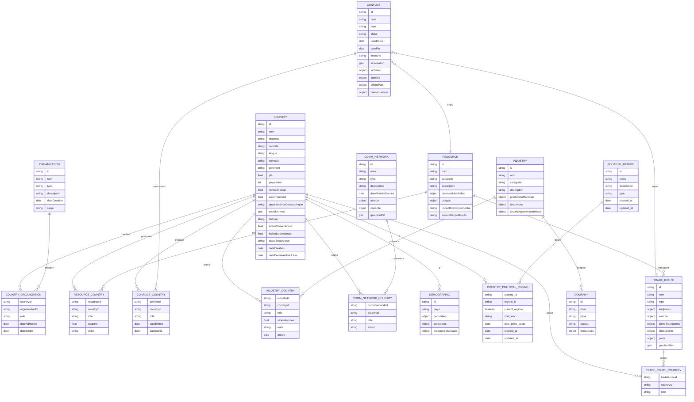

# Base de données WikiGeopolitics

## Vue d'ensemble

WikiGeopolitics utilise une **base de données PostgreSQL** avec l'extension **PostGIS** pour gérer les données géospatiales. La base de données est conteneurisée avec Docker pour faciliter le déploiement et la gestion.

**🔄 Mise à jour : Système de régimes politiques et chefs d'État optimisé (Janvier 2025)**
- ✅ Suppression des tables redondantes (`international_relation`, `international_relation_country`)
- ✅ Nettoyage des redondances dans `organization` (OTAN, ASEAN, OPEP)
- ✅ Harmonisation des types d'organisations (17 types cohérents)
- ✅ Correction de la classification du Mercosur (Union politique et économique)
- ✅ Migration des données uniques vers le système unifié
- ✅ Suppression du trigger problématique sur `organization`
- ✅ Vérification d'intégrité complète des références
- ✅ **Nouveau** : Système de régimes politiques avec table `political_regime` et `country_political_regime`
- ✅ **Nouveau** : Champs chef d'État (`chef_etat`, `date_prise_poste`) dans `country_political_regime`
- ✅ **Nouveau** : Suppression des colonnes obsolètes (`regimepolitique`, `chefetat`) de la table `country`
- ✅ **Nouveau** : 100% des pays (238) avec données de chef d'État complètes

## Architecture technique

### Technologies utilisées
- **PostgreSQL 15** : Base de données relationnelle principale
- **PostGIS** : Extension pour les données géospatiales
- **Docker & Docker Compose** : Conteneurisation
- **PgAdmin** : Interface d'administration web
- **Beekeeper Studio** : Client SQL recommandé

### Schéma de données (Rationalisé et optimisé)



## Rationalisation effectuée

### Tables supprimées (redondantes)
- ❌ `international_relation` → Migré vers `organization`
- ❌ `international_relation_country` → Migré vers `country_organization`
- ❌ `relation` → Supprimé (redondant avec `organization`)
- ❌ `relation_country` → Supprimé (redondant avec `country_organization`)
- ❌ `organization_relation` → Supprimé (redondant)
- ❌ `country_relation` → Supprimé (redondant)

### Colonnes supprimées (obsolètes)
- ❌ `regimepolitique` de la table `country` → Migré vers `country_political_regime`
- ❌ `chefetat` de la table `country` → Migré vers `country_political_regime`
- ❌ `current_regime_id` de la table `country` → Remplacé par la relation `country_political_regime`

### Redondances nettoyées dans `organization`
- ❌ `otan` → ✅ `org_nato` (nom complet avec acronyme)
- ❌ `asean` → ✅ `org_asean` (nom complet avec acronyme)
- ❌ `org_opec_plus` → ✅ `org_opec` (entité principale)

### Types d'organisations harmonisés (17 types)
1. **Organisation commerciale** : 4 organisations
2. **Organisation économique** : 4 organisations
3. **Alliance militaire** : 3 organisations
4. **Organisation diplomatique** : 3 organisations
5. **Organisation régionale** : 3 organisations
6. **Organisation spécialisée** : 3 organisations
7. **Union politique et économique** : 3 organisations
8. **Forum économique** : 2 organisations
9. **Institution financière** : 2 organisations
10. **Organisation énergétique** : 2 organisations
11. **Cartel pétrolier** : 1 organisation
12. **Organisation culturelle** : 1 organisation
13. **Organisation de normalisation** : 1 organisation
14. **Organisation gazière** : 1 organisation
15. **Organisation intergouvernementale** : 1 organisation
16. **Organisation internationale** : 1 organisation
17. **Union douanière** : 1 organisation

### Corrections de classification
- **Mercosur** : `Union douanière` → `Union politique et économique`
- **Conseil de coopération du Golfe** : `Organisation régionale` → `Organisation diplomatique`
- **Communautés économiques africaines** : `Organisation régionale` → `Organisation économique`
- **APEC** : `Forum économique` → `Organisation économique`
- **ZLECAf** : `Zone de libre-échange` → `Organisation commerciale`

## Configuration Docker

### Fichiers de configuration

#### docker-compose.yml
```yaml
version: '3.8'

services:
  postgres:
    image: postgis/postgis:15-3.4
    container_name: wikigeopolitics-db
    restart: unless-stopped
    environment:
      POSTGRES_DB: wikigeopolitics
      POSTGRES_USER: wikigeo_user
      POSTGRES_PASSWORD: wikigeo_password
      POSTGRES_INITDB_ARGS: "--encoding=UTF-8 --lc-collate=C --lc-ctype=C"
    ports:
      - "5433:5432"
    volumes:
      - postgres_data:/var/lib/postgresql/data
      - ./database/init:/docker-entrypoint-initdb.d
      - ./database/backups:/backups
    networks:
      - wikigeopolitics-network

  pgadmin:
    image: dpage/pgadmin4:latest
    container_name: wikigeopolitics-pgadmin
    restart: unless-stopped
    environment:
      PGADMIN_DEFAULT_EMAIL: admin@wikigeopolitics.com
      PGADMIN_DEFAULT_PASSWORD: admin_password
      PGADMIN_CONFIG_SERVER_MODE: 'False'
    ports:
      - "5050:80"
    volumes:
      - pgadmin_data:/var/lib/pgadmin
    networks:
      - wikigeopolitics-network
    depends_on:
      - postgres
```

### Informations de connexion

| Paramètre | Valeur |
|-----------|--------|
| **Host** | localhost |
| **Port** | 5433 |
| **Database** | wikigeopolitics |
| **Username** | wikigeo_user |
| **Password** | wikigeo_password |

### Interface d'administration
- **PgAdmin** : http://localhost:5050
- **Email** : admin@wikigeopolitics.com
- **Password** : admin_password

## Scripts de gestion

### Démarrage de la base de données
```bash
./database/scripts/start-db.sh
```

### Arrêt de la base de données
```bash
./database/scripts/stop-db.sh
```

### Sauvegarde
```bash
./database/scripts/backup.sh
```

### Restauration
```bash
./database/scripts/restore.sh
```

## Structure des tables (Rationalisée)

### Tables principales

#### COUNTRY (Pays)
Table centrale contenant les informations sur les pays avec données économiques et géopolitiques.

```sql
CREATE TABLE country (
    id VARCHAR(50) PRIMARY KEY,
    nom VARCHAR(255) NOT NULL,
    drapeau VARCHAR(255),
    capitale VARCHAR(255),
    langue VARCHAR(255),
    monnaie VARCHAR(100),
    continent VARCHAR(100),
    sections JSONB,
    indicateurs JSONB,
    politique JSONB,
    economie JSONB,
    demographie JSONB,
    frontieres JSONB,
    coordonnees GEOMETRY(POINT, 4326),
    -- Nouvelles colonnes selon le schéma cible
    pib FLOAT,
    population INTEGER,
    revenuMedian FLOAT,
    superficieKm2 FLOAT,
    appartenanceGeographique VARCHAR(100),
    histoire TEXT,
    indiceSouverainete FLOAT,
    indiceDependance FLOAT,
    statutStrategique VARCHAR(100),
    dateCreation DATE,
    dateDerniereMiseAJour DATE,
    created_at TIMESTAMP DEFAULT CURRENT_TIMESTAMP,
    updated_at TIMESTAMP DEFAULT CURRENT_TIMESTAMP
);
```

#### POLITICAL_REGIME (Régimes politiques)
Table des types de régimes politiques disponibles.

```sql
CREATE TABLE political_regime (
    id VARCHAR(50) PRIMARY KEY,
    name VARCHAR(255) NOT NULL,
    description TEXT,
    type VARCHAR(100),
    created_at TIMESTAMP DEFAULT CURRENT_TIMESTAMP,
    updated_at TIMESTAMP DEFAULT CURRENT_TIMESTAMP
);
```

#### COUNTRY_POLITICAL_REGIME (Relation pays-régimes)
Table de relation entre pays et régimes politiques avec informations sur les chefs d'État.

```sql
CREATE TABLE country_political_regime (
    country_id VARCHAR(50) REFERENCES country(id) ON DELETE CASCADE,
    regime_id VARCHAR(50) REFERENCES political_regime(id) ON DELETE CASCADE,
    current_regime BOOLEAN DEFAULT false,
    chef_etat VARCHAR(255),
    date_prise_poste DATE,
    created_at TIMESTAMP DEFAULT CURRENT_TIMESTAMP,
    updated_at TIMESTAMP DEFAULT CURRENT_TIMESTAMP,
    PRIMARY KEY (country_id, regime_id)
);
```

#### ORGANIZATION (Organisations internationales)
```sql
CREATE TABLE organization (
    id VARCHAR(50) PRIMARY KEY,
    nom VARCHAR(255) NOT NULL,
    type VARCHAR(100),
    description TEXT,
    dateCreation DATE,
    siege VARCHAR(255),
    created_at TIMESTAMP DEFAULT CURRENT_TIMESTAMP,
    updated_at TIMESTAMP DEFAULT CURRENT_TIMESTAMP
);
```

#### CONFLICT (Conflits armés)
```sql
CREATE TABLE conflict (
    id VARCHAR(50) PRIMARY KEY,
    nom VARCHAR(255) NOT NULL,
    type VARCHAR(100),
    statut VARCHAR(100),
    dateDebut DATE,
    dateFin DATE,
    intensite VARCHAR(50),
    localisation GEOMETRY(POLYGON, 4326),
    victimes JSONB,
    timeline JSONB,
    efforts_paix JSONB,
    consequences JSONB,
    created_at TIMESTAMP DEFAULT CURRENT_TIMESTAMP,
    updated_at TIMESTAMP DEFAULT CURRENT_TIMESTAMP
);
```

#### RESOURCE (Ressources naturelles)
```sql
CREATE TABLE resource (
    id VARCHAR(50) PRIMARY KEY,
    nom VARCHAR(255) NOT NULL,
    categorie VARCHAR(100),
    description TEXT,
    reserves_mondiales JSONB,
    usages JSONB,
    impactEnvironnemental TEXT,
    enjeux_geopolitiques TEXT,
    created_at TIMESTAMP DEFAULT CURRENT_TIMESTAMP,
    updated_at TIMESTAMP DEFAULT CURRENT_TIMESTAMP
);
```

#### INDUSTRY (Industries)
```sql
CREATE TABLE industry (
    id VARCHAR(50) PRIMARY KEY,
    nom VARCHAR(255) NOT NULL,
    categorie VARCHAR(100),
    description TEXT,
    production_mondiale JSONB,
    tendances JSONB,
    chaine_approvisionnement JSONB,
    statut VARCHAR(100),
    created_at TIMESTAMP DEFAULT CURRENT_TIMESTAMP,
    updated_at TIMESTAMP DEFAULT CURRENT_TIMESTAMP
);
```

#### COMPANY (Entreprises)
```sql
CREATE TABLE company (
    id VARCHAR(50) PRIMARY KEY,
    nom VARCHAR(255) NOT NULL,
    pays VARCHAR(50) REFERENCES country(id),
    secteur VARCHAR(100),
    indicateurs JSONB,
    description TEXT,
    statut VARCHAR(100),
    created_at TIMESTAMP DEFAULT CURRENT_TIMESTAMP,
    updated_at TIMESTAMP DEFAULT CURRENT_TIMESTAMP
);
```

#### TRADE_ROUTE (Routes commerciales)
```sql
CREATE TABLE trade_route (
    id VARCHAR(50) PRIMARY KEY,
    nom VARCHAR(255) NOT NULL,
    type VARCHAR(100),
    endpoints JSONB,
    volume JSONB,
    biens_transportes JSONB,
    chokepoints JSONB,
    ports JSONB,
    geoJsonRef TEXT,
    created_at TIMESTAMP DEFAULT CURRENT_TIMESTAMP,
    updated_at TIMESTAMP DEFAULT CURRENT_TIMESTAMP
);
```

#### COMM_NETWORK (Réseaux de communication)
```sql
CREATE TABLE comm_network (
    id VARCHAR(50) PRIMARY KEY,
    nom VARCHAR(255) NOT NULL,
    type VARCHAR(100),
    description TEXT,
    dateMiseEnService DATE,
    acteurs JSONB,
    capacite JSONB,
    geoJsonRef GEOMETRY,
    created_at TIMESTAMP DEFAULT CURRENT_TIMESTAMP,
    updated_at TIMESTAMP DEFAULT CURRENT_TIMESTAMP
);
```

### Tables de relation (Junction tables)

#### COUNTRY_ORGANIZATION
Relation entre pays et organisations (membres d'organisations)
```sql
CREATE TABLE country_organization (
    countryId VARCHAR(50) REFERENCES country(id) ON DELETE CASCADE,
    organizationId VARCHAR(50) REFERENCES organization(id) ON DELETE CASCADE,
    role VARCHAR(100),
    dateAdhesion DATE,
    dateSortie DATE,
    statut VARCHAR(100),
    PRIMARY KEY (countryId, organizationId)
);
```

#### CONFLICT_COUNTRY
Relation entre pays et conflits (pays impliqués dans des conflits)
```sql
CREATE TABLE conflict_country (
    conflictId VARCHAR(50) REFERENCES conflict(id) ON DELETE CASCADE,
    countryId VARCHAR(50) REFERENCES country(id) ON DELETE CASCADE,
    role VARCHAR(100),
    dateEntree DATE,
    dateSortie DATE,
    PRIMARY KEY (conflictId, countryId)
);
```

#### RESOURCE_COUNTRY
Relation entre pays et ressources (production de ressources par pays)
```sql
CREATE TABLE resource_country (
    resourceId VARCHAR(50) REFERENCES resource(id) ON DELETE CASCADE,
    countryId VARCHAR(50) REFERENCES country(id) ON DELETE CASCADE,
    role VARCHAR(100),
    quantite FLOAT,
    unite VARCHAR(50),
    PRIMARY KEY (resourceId, countryId)
);
```

#### INDUSTRY_COUNTRY
Relation entre pays et industries (production industrielle par pays)
```sql
CREATE TABLE industry_country (
    industryId VARCHAR(50) REFERENCES industry(id) ON DELETE CASCADE,
    countryId VARCHAR(50) REFERENCES country(id) ON DELETE CASCADE,
    role VARCHAR(100),
    valeurAjoutee FLOAT,
    unite VARCHAR(50),
    annee DATE,
    PRIMARY KEY (industryId, countryId)
);
```

#### TRADE_ROUTE_COUNTRY
Relation entre pays et routes commerciales
```sql
CREATE TABLE trade_route_country (
    tradeRouteId VARCHAR(50) REFERENCES trade_route(id) ON DELETE CASCADE,
    countryId VARCHAR(50) REFERENCES country(id) ON DELETE CASCADE,
    role VARCHAR(100),
    PRIMARY KEY (tradeRouteId, countryId)
);
```

#### COMM_NETWORK_COUNTRY
Relation entre pays et réseaux de communication
```sql
CREATE TABLE comm_network_country (
    commNetworkId VARCHAR(50) REFERENCES comm_network(id) ON DELETE CASCADE,
    countryId VARCHAR(50) REFERENCES country(id) ON DELETE CASCADE,
    role VARCHAR(100),
    statut VARCHAR(100),
    PRIMARY KEY (commNetworkId, countryId)
);
```

## Vues utiles

### v_country_organizations
Vue des pays avec leurs organisations
```sql
CREATE OR REPLACE VIEW v_country_organizations AS
SELECT 
    c.id,
    c.nom,
    c.capitale,
    c.continent,
    array_agg(DISTINCT o.nom) as organisations
FROM country c
LEFT JOIN country_organization co ON c.id = co.countryId
LEFT JOIN organization o ON co.organizationId = o.id
GROUP BY c.id, c.nom, c.capitale, c.continent;
```

### v_conflict_countries
Vue des conflits avec les pays impliqués
```sql
CREATE OR REPLACE VIEW v_conflict_countries AS
SELECT 
    cf.id,
    cf.nom,
    cf.type,
    cf.statut,
    cf.dateDebut,
    array_agg(DISTINCT c.nom) as pays_impliques
FROM conflict cf
LEFT JOIN conflict_country cc ON cf.id = cc.conflictId
LEFT JOIN country c ON cc.countryId = c.id
GROUP BY cf.id, cf.nom, cf.type, cf.statut, cf.dateDebut;
```

### v_country_economic_indicators
Vue des indicateurs économiques par pays
```sql
CREATE OR REPLACE VIEW v_country_economic_indicators AS
SELECT 
    id,
    nom,
    pib,
    population,
    revenuMedian,
    superficieKm2,
    indiceSouverainete,
    indiceDependance,
    statutStrategique
FROM country
WHERE pib IS NOT NULL OR population IS NOT NULL
ORDER BY pib DESC NULLS LAST;
```

## Données d'exemple

La base de données est initialisée avec des données d'exemple basées sur les fichiers JSON existants dans `src/data/` :

- **238 pays** avec coordonnées géospatiales (complète)
- **35 organisations internationales** (rationalisées et nettoyées)
- **124 relations pays-organisations** (système unifié)
- **10 régimes politiques** (démocratie, monarchie, dictature, etc.)
- **238 relations pays-régimes** avec données de chefs d'État (100% complète)
- **3 conflits armés** avec géométries
- **8 ressources naturelles** (pétrole, gaz, lithium, etc.)
- **8 industries** (automobile, informatique, pharmaceutique, etc.)
- **8 entreprises majeures** (Tesla, Toyota, Apple, etc.)
- **4 routes commerciales** (Suez, Malacca, Ormuz, Panama)
- **5 conflits armés** avec données détaillées
- **Réseaux de communication** (structure prête)
- **Données économiques et géopolitiques** (structure prête)

## Requêtes utiles

### Pays par continent avec indicateurs économiques
```sql
SELECT 
    continent, 
    array_agg(nom) as pays,
    AVG(pib) as pib_moyen,
    SUM(population) as population_totale
FROM country
WHERE continent IS NOT NULL
GROUP BY continent
ORDER BY pib_moyen DESC;
```

### Conflits en cours avec pays impliqués
```sql
SELECT cf.nom, cf.type, cf.intensite, 
       array_agg(c.nom) as pays_impliques
FROM conflict cf
JOIN conflict_country cc ON cf.id = cc.conflictId
JOIN country c ON cc.countryId = c.id
WHERE cf.statut = 'En cours'
GROUP BY cf.id, cf.nom, cf.type, cf.intensite;
```

### Ressources par pays avec quantités
```sql
SELECT c.nom, r.nom as ressource, rc.quantite, rc.unite
FROM country c
JOIN resource_country rc ON c.id = rc.countryId
JOIN resource r ON rc.resourceId = r.id
ORDER BY c.nom, r.nom;
```

### Industries par pays avec valeur ajoutée
```sql
SELECT c.nom, i.nom as industrie, ic.valeurAjoutee, ic.unite
FROM country c
JOIN industry_country ic ON c.id = ic.countryId
JOIN industry i ON ic.industryId = i.id
WHERE ic.annee = '2021-01-01'
ORDER BY ic.valeurAjoutee DESC;
```

### Pays par indice de souveraineté
```sql
SELECT nom, indiceSouverainete, indiceDependance, statutStrategique
FROM country
WHERE indiceSouverainete IS NOT NULL
ORDER BY indiceSouverainete DESC;
```

### Organisations par type (après rationalisation)
```sql
SELECT 
    type,
    COUNT(*) as nombre_organisations,
    array_agg(nom ORDER BY nom) as organisations
FROM organization 
GROUP BY type 
ORDER BY nombre_organisations DESC, type;
```

### Pays les plus impliqués dans les organisations
```sql
SELECT 
    c.nom as pays,
    COUNT(co.organizationId) as nombre_organisations
FROM country c
JOIN country_organization co ON c.id = co.countryId
GROUP BY c.id, c.nom
ORDER BY nombre_organisations DESC
LIMIT 10;
```

### Régimes politiques par pays avec chefs d'État
```sql
SELECT 
    c.nom as pays,
    pr.name as regime_politique,
    cpr.chef_etat,
    cpr.date_prise_poste,
    cpr.current_regime
FROM country c
JOIN country_political_regime cpr ON c.id = cpr.country_id
JOIN political_regime pr ON cpr.regime_id = pr.id
WHERE cpr.current_regime = true
ORDER BY c.nom;
```

### Pays par type de régime politique
```sql
SELECT 
    pr.name as regime_politique,
    COUNT(c.id) as nombre_pays,
    array_agg(c.nom ORDER BY c.nom) as pays
FROM political_regime pr
JOIN country_political_regime cpr ON pr.id = cpr.regime_id
JOIN country c ON cpr.country_id = c.id
WHERE cpr.current_regime = true
GROUP BY pr.id, pr.name
ORDER BY nombre_pays DESC;
```

### Chefs d'État récents (prise de poste après 2020)
```sql
SELECT 
    c.nom as pays,
    cpr.chef_etat,
    cpr.date_prise_poste,
    pr.name as regime_politique
FROM country_political_regime cpr
JOIN country c ON cpr.country_id = c.id
JOIN political_regime pr ON cpr.regime_id = pr.id
WHERE cpr.current_regime = true 
    AND cpr.date_prise_poste >= '2020-01-01'
ORDER BY cpr.date_prise_poste DESC;
```

## Maintenance

### Sauvegarde automatique
Les sauvegardes sont stockées dans `database/backups/` avec le format :
```
wikigeopolitics_backup_YYYYMMDD_HHMMSS.sql
```

### Restauration
```bash
# Lister les sauvegardes disponibles
ls -la database/backups/

# Restaurer une sauvegarde
./database/scripts/restore.sh
```

## Intégration avec l'application

### Connexion depuis l'application Vue.js
```typescript
// Exemple de configuration de connexion
const dbConfig = {
  host: 'localhost',
  port: 5433,
  database: 'wikigeopolitics',
  user: 'wikigeo_user',
  password: 'wikigeo_password'
};
```

### Requêtes géospatiales
```sql
-- Trouver les pays dans un rayon de 1000km
SELECT nom, ST_Distance(coordonnees, ST_SetSRID(ST_MakePoint(2.2137, 46.2276), 4326)) as distance
FROM country
WHERE ST_DWithin(coordonnees, ST_SetSRID(ST_MakePoint(2.2137, 46.2276), 4326), 1000000)
ORDER BY distance;
```

## Sécurité

### Bonnes pratiques
- ✅ Mots de passe forts
- ✅ Conteneurisation isolée
- ✅ Sauvegardes régulières
- ✅ Accès limité aux ports nécessaires
- ✅ Logs de connexion

### Variables d'environnement
Pour la production, utilisez des variables d'environnement :
```bash
export POSTGRES_PASSWORD=your_secure_password
export PGADMIN_PASSWORD=your_admin_password
```

## Troubleshooting

### Problèmes courants

#### Conteneur ne démarre pas
```bash
# Vérifier les logs
docker-compose logs postgres

# Redémarrer les conteneurs
docker-compose down && docker-compose up -d
```

#### Erreur de connexion
```bash
# Vérifier que le port 5433 est libre
lsof -i :5433

# Tester la connexion
docker exec -it wikigeopolitics-db psql -U wikigeo_user -d wikigeopolitics
```

#### Problème de permissions
```bash
# Corriger les permissions des volumes
sudo chown -R 999:999 database/
```

## Légende du schéma
- **||--o{** : relation 1 à plusieurs (ex : un pays a plusieurs conflits)
- **}o--||** : relation plusieurs à 1 (ex : plusieurs conflits liés à une ressource)
- **string/geo/object/date** : type de champ

## Explication des entités
- **COUNTRY** (pays) est la table centrale, reliée à toutes les autres entités avec données économiques et géopolitiques complètes.
- **POLITICAL_REGIME** (régimes politiques) définit les types de régimes (démocratie, monarchie, dictature, etc.).
- **COUNTRY_POLITICAL_REGIME** (relation pays-régimes) gère les régimes actuels et historiques des pays avec informations sur les chefs d'État.
- **ORGANIZATION** (organisations internationales) regroupe alliances, coalitions, etc. (35 organisations rationalisées).
- **CONFLICT** (conflits armés ou historiques) : parties, timeline, conséquences...
- **RESOURCE** (ressources naturelles) : producteurs, routes, conflits associés...
- **INDUSTRY** (secteurs économiques/industriels) : production, entreprises, tendances...
- **COMPANY** (entreprises majeures, acteurs industriels)
- **TRADE_ROUTE** (routes commerciales, transport) : endpoints, volume, ports, geoJson
- **COMM_NETWORK** (réseaux de communication) : infrastructure, acteurs, capacité
- **DEMOGRAPHIC** (démographie et société) : population, tendances, indicateurs sociaux

Ce schéma est maintenant parfaitement rationalisé et optimisé, avec un système unifié pour les organisations et leurs relations avec les pays, ainsi qu'un système complet de gestion des régimes politiques et des chefs d'État. Toutes les redondances ont été supprimées et les types d'organisations harmonisés pour une meilleure cohérence et facilité d'utilisation. 