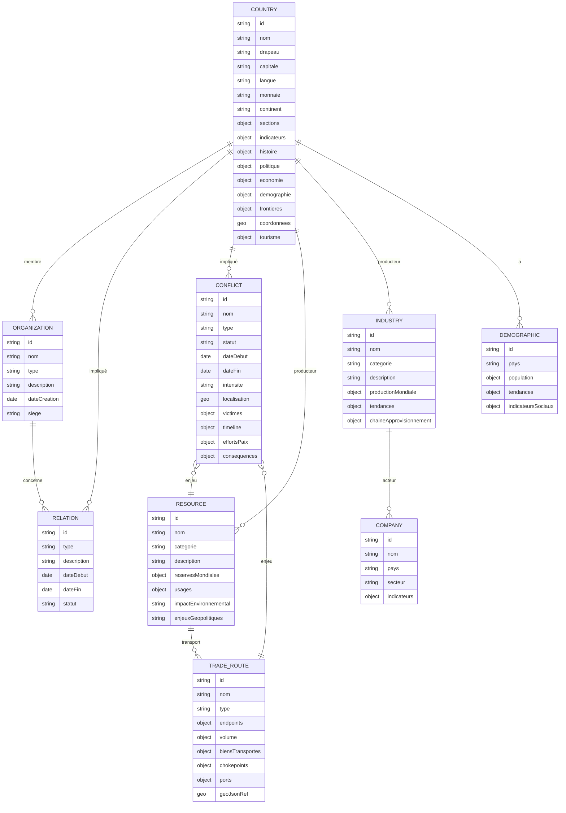

# Base de données WikiGeopolitics

## Vue d'ensemble

WikiGeopolitics utilise une **base de données PostgreSQL** avec l'extension **PostGIS** pour gérer les données géospatiales. La base de données est conteneurisée avec Docker pour faciliter le déploiement et la gestion.

## Architecture technique

### Technologies utilisées
- **PostgreSQL 15** : Base de données relationnelle principale
- **PostGIS** : Extension pour les données géospatiales
- **Docker & Docker Compose** : Conteneurisation
- **PgAdmin** : Interface d'administration web
- **Beekeeper Studio** : Client SQL recommandé

### Schéma de données



## Configuration Docker

### Fichiers de configuration

#### docker-compose.yml
```yaml
version: '3.8'

services:
  postgres:
    image: postgres:15-alpine
    container_name: wikigeopolitics-db
    restart: unless-stopped
    environment:
      POSTGRES_DB: wikigeopolitics
      POSTGRES_USER: wikigeo_user
      POSTGRES_PASSWORD: wikigeo_password
      POSTGRES_INITDB_ARGS: "--encoding=UTF-8 --lc-collate=C --lc-ctype=C"
    ports:
      - "5432:5432"
    volumes:
      - postgres_data:/var/lib/postgresql/data
      - ./database/init:/docker-entrypoint-initdb.d
      - ./database/backups:/backups
    networks:
      - wikigeopolitics-network

  pgadmin:
    image: dpage/pgadmin4:latest
    container_name: wikigeopolitics-pgadmin
    restart: unless-stopped
    environment:
      PGADMIN_DEFAULT_EMAIL: admin@wikigeopolitics.com
      PGADMIN_DEFAULT_PASSWORD: admin_password
      PGADMIN_CONFIG_SERVER_MODE: 'False'
    ports:
      - "5050:80"
    volumes:
      - pgadmin_data:/var/lib/pgadmin
    networks:
      - wikigeopolitics-network
    depends_on:
      - postgres
```

### Informations de connexion

| Paramètre | Valeur |
|-----------|--------|
| **Host** | localhost |
| **Port** | 5432 |
| **Database** | wikigeopolitics |
| **Username** | wikigeo_user |
| **Password** | wikigeo_password |

### Interface d'administration
- **PgAdmin** : http://localhost:5050
- **Email** : admin@wikigeopolitics.com
- **Password** : admin_password

## Scripts de gestion

### Démarrage de la base de données
```bash
./database/scripts/start-db.sh
```

### Arrêt de la base de données
```bash
./database/scripts/stop-db.sh
```

### Sauvegarde
```bash
./database/scripts/backup.sh
```

### Restauration
```bash
./database/scripts/restore.sh
```

## Structure des tables

### Tables principales

#### COUNTRY (Pays)
Table centrale contenant les informations sur les pays et leur continent.

```sql
CREATE TABLE country (
    id VARCHAR(50) PRIMARY KEY,
    nom VARCHAR(255) NOT NULL,
    drapeau VARCHAR(255),
    capitale VARCHAR(255),
    langue VARCHAR(255),
    monnaie VARCHAR(100),
    continent VARCHAR(100), -- ex: 'Europe', 'Asie', etc.
    current_regime_id VARCHAR(50) REFERENCES political_regime(id),
    sections JSONB,
    indicateurs JSONB,
    histoire JSONB,
    politique JSONB,
    economie JSONB,
    demographie JSONB,
    frontieres JSONB,
    coordonnees GEOMETRY(POINT, 4326),
    tourisme JSONB,
    created_at TIMESTAMP DEFAULT CURRENT_TIMESTAMP,
    updated_at TIMESTAMP DEFAULT CURRENT_TIMESTAMP
);
```

#### POLITICAL_REGIME (Régimes politiques)
```sql
CREATE TABLE political_regime (
    id VARCHAR(50) PRIMARY KEY,
    name VARCHAR(100) NOT NULL,
    description TEXT,
    characteristics JSONB,
    examples JSONB,
    created_at TIMESTAMP DEFAULT CURRENT_TIMESTAMP,
    updated_at TIMESTAMP DEFAULT CURRENT_TIMESTAMP
);
```

#### ORGANIZATION (Organisations internationales)
```sql
CREATE TABLE organization (
    id VARCHAR(50) PRIMARY KEY,
    nom VARCHAR(255) NOT NULL,
    type VARCHAR(100),
    description TEXT,
    date_creation DATE,
    siege VARCHAR(255),
    created_at TIMESTAMP DEFAULT CURRENT_TIMESTAMP,
    updated_at TIMESTAMP DEFAULT CURRENT_TIMESTAMP
);
```

#### CONFLICT (Conflits armés)
```sql
CREATE TABLE conflict (
    id VARCHAR(50) PRIMARY KEY,
    nom VARCHAR(255) NOT NULL,
    type VARCHAR(100),
    statut VARCHAR(100),
    date_debut DATE,
    date_fin DATE,
    intensite VARCHAR(50),
    localisation GEOMETRY(POLYGON, 4326),
    victimes JSONB,
    timeline JSONB,
    efforts_paix JSONB,
    consequences JSONB,
    created_at TIMESTAMP DEFAULT CURRENT_TIMESTAMP,
    updated_at TIMESTAMP DEFAULT CURRENT_TIMESTAMP
);
```

### Tables de relation (Junction tables)

#### country_organization
Relation entre pays et organisations (membres d'organisations)
```sql
CREATE TABLE country_organization (
    country_id VARCHAR(50) REFERENCES country(id) ON DELETE CASCADE,
    organization_id VARCHAR(50) REFERENCES organization(id) ON DELETE CASCADE,
    role VARCHAR(100),
    date_adhesion DATE,
    statut VARCHAR(100),
    PRIMARY KEY (country_id, organization_id)
);
```

#### country_conflict
Relation entre pays et conflits (pays impliqués dans des conflits)
```sql
CREATE TABLE country_conflict (
    country_id VARCHAR(50) REFERENCES country(id) ON DELETE CASCADE,
    conflict_id VARCHAR(50) REFERENCES conflict(id) ON DELETE CASCADE,
    role VARCHAR(100),
    PRIMARY KEY (country_id, conflict_id)
);
```

## Vues utiles

### v_country_organizations
Vue des pays avec leurs organisations
```sql
CREATE OR REPLACE VIEW v_country_organizations AS
SELECT 
    c.id,
    c.nom,
    c.capitale,
    c.continent,
    array_agg(DISTINCT o.nom) as organisations
FROM country c
LEFT JOIN country_organization co ON c.id = co.country_id
LEFT JOIN organization o ON co.organization_id = o.id
GROUP BY c.id, c.nom, c.capitale, c.continent;
```

### v_conflict_countries
Vue des conflits avec les pays impliqués
```sql
CREATE OR REPLACE VIEW v_conflict_countries AS
SELECT 
    cf.id,
    cf.nom,
    cf.type,
    cf.statut,
    cf.date_debut,
    array_agg(DISTINCT c.nom) as pays_impliques
FROM conflict cf
LEFT JOIN country_conflict cc ON cf.id = cc.conflict_id
LEFT JOIN country c ON cc.country_id = c.id
GROUP BY cf.id, cf.nom, cf.type, cf.statut, cf.date_debut;
```

## Données d'exemple

La base de données est initialisée avec des données d'exemple basées sur les fichiers JSON existants dans `src/data/` :

- **29 pays** avec coordonnées géospatiales
- **8 organisations internationales** (ONU, OTAN, UE, G7, G20, etc.)
- **6 relations internationales** (alliances, conflits, accords)
- **3 conflits armés** avec géométries
- **8 ressources naturelles** (pétrole, gaz, lithium, etc.)
- **8 industries** (automobile, informatique, pharmaceutique, etc.)
- **8 entreprises majeures** (Tesla, Toyota, Apple, etc.)
- **4 routes commerciales** (Suez, Malacca, Ormuz, Panama)

## Requêtes utiles

### Pays par continent
```sql
SELECT continent, array_agg(nom) as pays
FROM country
WHERE continent IS NOT NULL
GROUP BY continent
ORDER BY continent;
```

### Conflits en cours
```sql
SELECT cf.nom, cf.type, cf.intensite, 
       array_agg(c.nom) as pays_impliques
FROM conflict cf
JOIN country_conflict cc ON cf.id = cc.conflict_id
JOIN country c ON cc.country_id = c.id
WHERE cf.statut = 'En cours'
GROUP BY cf.id, cf.nom, cf.type, cf.intensite;
```

### Ressources par pays
```sql
SELECT c.nom, r.nom as ressource, cr.production_volume
FROM country c
JOIN country_resource cr ON c.id = cr.country_id
JOIN resource r ON cr.resource_id = r.id
ORDER BY c.nom, r.nom;
```

## Maintenance

### Sauvegarde automatique
Les sauvegardes sont stockées dans `database/backups/` avec le format :
```
wikigeopolitics_backup_YYYYMMDD_HHMMSS.sql
```

### Restauration
```bash
# Lister les sauvegardes disponibles
ls -la database/backups/

# Restaurer une sauvegarde
./database/scripts/restore.sh
```

## Intégration avec l'application

### Connexion depuis l'application Vue.js
```typescript
// Exemple de configuration de connexion
const dbConfig = {
  host: 'localhost',
  port: 5432,
  database: 'wikigeopolitics',
  user: 'wikigeo_user',
  password: 'wikigeo_password'
};
```

### Requêtes géospatiales
```sql
-- Trouver les pays dans un rayon de 1000km
SELECT nom, ST_Distance(coordonnees, ST_SetSRID(ST_MakePoint(2.2137, 46.2276), 4326)) as distance
FROM country
WHERE ST_DWithin(coordonnees, ST_SetSRID(ST_MakePoint(2.2137, 46.2276), 4326), 1000000)
ORDER BY distance;
```

## Sécurité

### Bonnes pratiques
- ✅ Mots de passe forts
- ✅ Conteneurisation isolée
- ✅ Sauvegardes régulières
- ✅ Accès limité aux ports nécessaires
- ✅ Logs de connexion

### Variables d'environnement
Pour la production, utilisez des variables d'environnement :
```bash
export POSTGRES_PASSWORD=your_secure_password
export PGADMIN_PASSWORD=your_admin_password
```

## Troubleshooting

### Problèmes courants

#### Conteneur ne démarre pas
```bash
# Vérifier les logs
docker-compose logs postgres

# Redémarrer les conteneurs
docker-compose down && docker-compose up -d
```

#### Erreur de connexion
```bash
# Vérifier que le port 5432 est libre
lsof -i :5432

# Tester la connexion
docker exec -it wikigeopolitics-db psql -U wikigeo_user -d wikigeopolitics
```

#### Problème de permissions
```bash
# Corriger les permissions des volumes
sudo chown -R 999:999 database/
```

## Légende du schéma
- **||--o{** : relation 1 à plusieurs (ex : un pays a plusieurs conflits)
- **}o--||** : relation plusieurs à 1 (ex : plusieurs conflits liés à une ressource)
- **string/geo/object/date** : type de champ

## Explication des entités
- **COUNTRY** (pays) est la table centrale, reliée à toutes les autres entités.
- **ORGANIZATION** (organisations internationales) regroupe alliances, coalitions, etc.
- **RELATION** (relations internationales) : alliances, conflits, accords, sanctions...
- **CONFLICT** (conflits armés ou historiques) : parties, timeline, conséquences...
- **RESOURCE** (ressources naturelles) : producteurs, routes, conflits associés...
- **INDUSTRY** (secteurs économiques/industriels) : production, entreprises, tendances...
- **COMPANY** (entreprises majeures, acteurs industriels)
- **DEMOGRAPHIC** (démographie et société) : population, tendances, indicateurs sociaux
- **TRADE_ROUTE** (routes commerciales, transport) : endpoints, volume, ports, geoJson

Ce schéma est extensible et permet d'exploiter toutes les données du dossier `@/data` de façon relationnelle et efficace pour l'interface. 