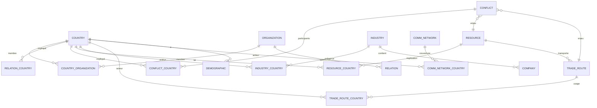

# Documentation Technique - WikiGeopolitics

## 🎯 Vue d'ensemble

**WikiGeopolitics** est une application web de cartographie géopolitique interactive développée avec une architecture moderne et scalable.

**🔄 Mise à jour : Navigation dynamique implémentée (Janvier 2025)**

### Navigation dynamique

#### Structure de navigation
- **Menu principal** : Lecture dynamique depuis `src/data/app/menu.json`
- **Sous-pages** : Gestion automatique des sous-menus
- **Données dynamiques** : Intégration avec la base de données pour les régimes politiques et organisations

#### Endpoints API de navigation

```typescript
// Navigation principale
GET /api/navigation
// Retourne les catégories principales et organisations

// Catégories et sous-pages
GET /api/categories/:id
// Retourne les données d'une catégorie ou sous-page

// Organisations classées par type
GET /api/organizations
// Retourne les organisations groupées par type

// Régimes politiques
GET /api/political-regimes
// Retourne tous les régimes politiques

// Pays par régime
GET /api/political-regimes/:id/countries
// Retourne les pays d'un régime spécifique
```

#### Gestion des organisations

```typescript
// Structure des organisations par type
interface OrganizationsByType {
  [type: string]: Array<{
    id: string;
    title: string;
    type: string;
    description?: string;
  }>;
}

// Types d'organisations supportés
- Alliance militaire
- Cartel pétrolier
- Forum économique
- Institution financière
- Organisation commerciale
- Organisation culturelle
- Organisation diplomatique
- Organisation régionale
- Organisation spécialisée
- Union politique et économique
```

## 🏗️ Architecture technique

### Stack technologique

#### Frontend
- **Framework** : Vue.js 3 avec Composition API
- **Language** : TypeScript 5.x
- **Build tool** : Vite 5.x
- **State management** : Pinia
- **Styling** : CSS personnalisé avec design tokens
- **Cartographie** : Leaflet.js avec OpenStreetMap
- **Package manager** : Yarn

#### Backend (en développement)
- **Framework** : Node.js avec Express
- **Language** : TypeScript
- **Base de données** : PostgreSQL 15 avec PostGIS
- **ORM** : Prisma (prévu)
- **API** : RESTful avec documentation OpenAPI
- **Validation** : Zod (prévu)

#### Infrastructure
- **Conteneurisation** : Docker & Docker Compose
- **Base de données** : PostgreSQL 15 avec PostGIS
- **Administration** : PgAdmin
- **Versioning** : Git avec GitHub
- **CI/CD** : À configurer

### Architecture des données

#### Schéma de base de données (Aligné avec le schéma cible)



#### Tables principales (17 tables)

| Table | Description | Colonnes clés |
|-------|-------------|---------------|
| `country` | Pays avec données économiques et géopolitiques | id, nom, pib, population, coordonnees |
| `organization` | Organisations internationales | id, nom, type, dateCreation |
| `relation` | Relations internationales | id, nom, type, dateDebut, dateFin |
| `conflict` | Conflits armés | id, nom, type, statut, localisation |
| `resource` | Ressources naturelles | id, nom, categorie, impactEnvironnemental |
| `industry` | Industries | id, nom, categorie, production_mondiale |
| `company` | Entreprises | id, nom, pays, secteur, indicateurs |
| `trade_route` | Routes commerciales | id, nom, type, endpoints, geoJsonRef |
| `comm_network` | Réseaux de communication | id, nom, type, dateMiseEnService |
| `demographic` | Données démographiques | id, pays, population, tendances |

#### Tables de relation (7 tables)

| Table | Description | Relations |
|-------|-------------|-----------|
| `country_organization` | Pays membres d'organisations | countryId ↔ organizationId |
| `relation_country` | Pays impliqués dans des relations | relationId ↔ countryId |
| `conflict_country` | Pays impliqués dans des conflits | conflictId ↔ countryId |
| `resource_country` | Ressources par pays | resourceId ↔ countryId |
| `industry_country` | Industries par pays | industryId ↔ countryId |
| `trade_route_country` | Routes commerciales par pays | tradeRouteId ↔ countryId |
| `comm_network_country` | Réseaux de communication par pays | commNetworkId ↔ countryId |

## 🗄️ Configuration de la base de données

### Docker Compose

```yaml
version: '3.8'

services:
  postgres:
    image: postgres:15-alpine
    container_name: wikigeopolitics-db
    restart: unless-stopped
    environment:
      POSTGRES_DB: wikigeopolitics
      POSTGRES_USER: wikigeo_user
      POSTGRES_PASSWORD: wikigeo_password
      POSTGRES_INITDB_ARGS: "--encoding=UTF-8 --lc-collate=C --lc-ctype=C"
    ports:
      - "5432:5432"
    volumes:
      - postgres_data:/var/lib/postgresql/data
      - ./database/init:/docker-entrypoint-initdb.d
      - ./database/backups:/backups
    networks:
      - wikigeopolitics-network

  pgadmin:
    image: dpage/pgadmin4:latest
    container_name: wikigeopolitics-pgadmin
    restart: unless-stopped
    environment:
      PGADMIN_DEFAULT_EMAIL: admin@wikigeopolitics.com
      PGADMIN_DEFAULT_PASSWORD: admin_password
      PGADMIN_CONFIG_SERVER_MODE: 'False'
    ports:
      - "5050:80"
    volumes:
      - pgadmin_data:/var/lib/pgadmin
    networks:
      - wikigeopolitics-network
    depends_on:
      - postgres
```

### Scripts de gestion

```bash
# Démarrage
./database/scripts/start-db.sh

# Arrêt
./database/scripts/stop-db.sh

# Sauvegarde
./database/scripts/backup.sh

# Restauration
./database/scripts/restore.sh
```

## 🗺️ Interface cartographique

### Configuration Leaflet

```typescript
// Configuration de la carte
const mapConfig = {
  center: [20, 0],
  zoom: 2,
  minZoom: 1,
  maxZoom: 18,
  layers: [
    L.tileLayer('https://{s}.tile.openstreetmap.org/{z}/{x}/{y}.png', {
      attribution: '© OpenStreetMap contributors'
    })
  ]
};
```

### Gestion des marqueurs

```typescript
// Création des marqueurs de pays
const createCountryMarker = (country: Country) => {
  const marker = L.marker([country.coordonnees.lat, country.coordonnees.lng], {
    icon: createCustomIcon(country.drapeau)
  });
  
  marker.on('click', () => selectCountry(country.id));
  return marker;
};
```

### Sélection par proximité

```typescript
// Algorithme de sélection par proximité
const findNearestCountry = (point: L.LatLng, countries: Country[]) => {
  let nearest = null;
  let minDistance = Infinity;
  
  countries.forEach(country => {
    const distance = point.distanceTo(L.latLng(
      country.coordonnees.lat, 
      country.coordonnees.lng
    ));
    
    if (distance < minDistance) {
      minDistance = distance;
      nearest = country;
    }
  });
  
  return nearest;
};
```

## 📱 Interface utilisateur

### Navigation dynamique

L'application utilise maintenant un système de navigation dynamique qui lit les données depuis le fichier `src/data/app/menu.json` via l'API backend.

#### Architecture de navigation

```typescript
// API Backend - Lecture dynamique du menu.json
app.get('/api/navigation', async (req, res) => {
  const menuPath = path.join(__dirname, '../src/data/app/menu.json');
  const menuData = JSON.parse(fs.readFileSync(menuPath, 'utf8'));
  const mainNavigation = menuData.applicationStructure.mainNavigation;
  
  const categories = mainNavigation.map(category => ({
    id: category.id,
    title: category.title,
    items: category.items || []
  }));
  
  res.json({ categories, organizations });
});
```

#### Structure du fichier menu.json

```json
{
  "applicationStructure": {
    "mainNavigation": [
      {
        "id": "politique-et-regimes",
        "title": "Politique et Régimes",
        "type": "mainCategory",
        "items": [
          {
            "id": "regime-des-etats",
            "title": "Régime des états",
            "hasSubmenu": true
          }
        ]
      }
    ],
    "subPages": {
      "regime-des-etats": {
        "title": "Régime des états",
        "searchEnabled": true,
        "hasReturnButton": true,
        "items": [...]
      }
    }
  }
}
```

#### Avantages de la navigation dynamique

- ✅ **Modifications instantanées** : Les changements dans `menu.json` se reflètent immédiatement
- ✅ **Pas de redéploiement** : Aucun redémarrage du serveur nécessaire
- ✅ **Gestion centralisée** : Toute la navigation dans un seul fichier
- ✅ **Flexibilité** : Ajout/suppression de catégories sans code
- ✅ **Organisations dynamiques** : Récupération depuis la base de données

### Structure des composants

```
src/components/
├── aside/
│   ├── aside.vue              # Conteneur principal
│   ├── AsideMainView.vue      # Vue principale
│   ├── AsideNavigationView.vue # Navigation
│   ├── AsideDetailView.vue    # Détails des pays
│   ├── CollapsibleSection.vue # Sections repliables
│   └── DetailSection.vue      # Sections de détails
├── common/
│   ├── Button.vue             # Boutons réutilisables
│   ├── Search.vue             # Barre de recherche
│   ├── TabNavigation.vue      # Navigation par onglets
│   └── icons/
│       └── ChevronIcon.vue    # Icônes SVG
├── country/
│   └── CountryItem.vue        # Élément de pays
├── header/
│   └── header.vue             # En-tête de l'application
├── map/
│   ├── Map.vue                # Carte principale
│   ├── MapLayersControl.vue   # Contrôles de couches
│   └── map 2.vue             # Version alternative
├── navigation/
│   ├── MenuItem.vue           # Éléments de menu
│   └── ReturnButton.vue       # Bouton de retour
├── panels/
│   ├── FloatingDetailPanel.vue # Panneau de détails flottant
│   └── NewsView.vue           # Vue des actualités
└── timeline/
    └── Timeline.vue           # Timeline interactive
```

### Gestion d'état avec Pinia

```typescript
// Store pour la sélection de pays
export const useCountrySelectionStore = defineStore('countrySelection', () => {
  const selectedCountry = ref<Country | null>(null);
  const isDetailPanelOpen = ref(false);
  
  const selectCountry = (country: Country) => {
    selectedCountry.value = country;
    isDetailPanelOpen.value = true;
  };
  
  const clearSelection = () => {
    selectedCountry.value = null;
    isDetailPanelOpen.value = false;
  };
  
  return {
    selectedCountry,
    isDetailPanelOpen,
    selectCountry,
    clearSelection
  };
});
```

### Styles et design tokens

```css
/* Design tokens */
:root {
  --color-primary: #2563eb;
  --color-secondary: #64748b;
  --color-success: #10b981;
  --color-warning: #f59e0b;
  --color-error: #ef4444;
  
  --spacing-xs: 0.25rem;
  --spacing-sm: 0.5rem;
  --spacing-md: 1rem;
  --spacing-lg: 1.5rem;
  --spacing-xl: 2rem;
  
  --border-radius: 0.375rem;
  --border-radius-lg: 0.5rem;
  
  --shadow-sm: 0 1px 2px 0 rgb(0 0 0 / 0.05);
  --shadow-md: 0 4px 6px -1px rgb(0 0 0 / 0.1);
  --shadow-lg: 0 10px 15px -3px rgb(0 0 0 / 0.1);
}
```

## 🔧 Services et API

### Service de base de données

```typescript
// Configuration de connexion PostgreSQL
const dbConfig = {
  host: 'localhost',
  port: 5432,
  database: 'wikigeopolitics',
  user: 'wikigeo_user',
  password: 'wikigeo_password'
};

// Pool de connexions
const pool = new Pool(dbConfig);

// Requêtes optimisées
export const getCountries = async (): Promise<Country[]> => {
  const query = `
    SELECT 
      id, nom, drapeau, capitale, langue, monnaie, continent,
      pib, population, revenuMedian, superficieKm2,
      regimePolitique, appartenanceGeographique,
      ST_AsGeoJSON(coordonnees) as coordonnees
    FROM country
    ORDER BY nom
  `;
  
  const result = await pool.query(query);
  return result.rows;
};
```

### Service de lecture des données

```typescript
// Service pour les opérations de lecture
export class ReadService {
  // Récupération des pays avec filtres
  static async getCountries(filters?: CountryFilters): Promise<Country[]> {
    let query = 'SELECT * FROM country WHERE 1=1';
    const params: any[] = [];
    
    if (filters?.continent) {
      query += ' AND continent = $1';
      params.push(filters.continent);
    }
    
    if (filters?.regimePolitique) {
      query += ' AND regimePolitique = $2';
      params.push(filters.regimePolitique);
    }
    
    const result = await pool.query(query, params);
    return result.rows;
  }
  
  // Récupération des conflits avec pays impliqués
  static async getConflicts(): Promise<Conflict[]> {
    const query = `
      SELECT 
        c.*,
        array_agg(cc.countryId) as pays_impliques
      FROM conflict c
      LEFT JOIN conflict_country cc ON c.id = cc.conflictId
      GROUP BY c.id
    `;
    
    const result = await pool.query(query);
    return result.rows;
  }
}
```

## 📊 Données et modèles

### Types TypeScript

```typescript
// Types principaux
export interface Country {
  id: string;
  nom: string;
  drapeau?: string;
  capitale?: string;
  langue?: string;
  monnaie?: string;
  continent?: string;
  pib?: number;
  population?: number;
  revenuMedian?: number;
  superficieKm2?: number;
  regimePolitique?: string;
  appartenanceGeographique?: string;
  coordonnees: GeoJSON.Point;
  histoire?: string;
  indiceSouverainete?: number;
  indiceDependance?: number;
  statutStrategique?: string;
  dateCreation?: Date;
  dateDerniereMiseAJour?: Date;
}

export interface Conflict {
  id: string;
  nom: string;
  type: string;
  statut: string;
  dateDebut?: Date;
  dateFin?: Date;
  intensite?: string;
  localisation?: GeoJSON.Polygon;
  victimes?: any;
  timeline?: any;
  efforts_paix?: any;
  consequences?: any;
}

export interface Resource {
  id: string;
  nom: string;
  categorie: string;
  description?: string;
  reserves_mondiales?: any;
  usages?: any;
  impactEnvironnemental?: string;
  enjeux_geopolitiques?: string;
}
```

### Modèles de données JSON

```json
// Structure des données pays
{
  "id": "france",
  "nom": "France",
  "drapeau": "🇫🇷",
  "capitale": "Paris",
  "langue": "Français",
  "monnaie": "Euro (EUR)",
  "continent": "Europe",
  "pib": 2782900000000,
  "population": 67390000,
  "revenuMedian": 42000,
  "superficieKm2": 551695,
  "regimePolitique": "République démocratique",
  "appartenanceGeographique": "Union européenne",
  "coordonnees": {
    "type": "Point",
    "coordinates": [2.2137, 46.2276]
  },
  "histoire": "Histoire de la France...",
  "indiceSouverainete": 85.2,
  "indiceDependance": 14.8,
  "statutStrategique": "Puissance moyenne"
}
```

## 🚀 Déploiement et configuration

### Variables d'environnement

```bash
# .env
VITE_API_URL=http://localhost:3000
VITE_MAP_TILE_URL=https://{s}.tile.openstreetmap.org/{z}/{x}/{y}.png
POSTGRES_HOST=localhost
POSTGRES_PORT=5432
POSTGRES_DB=wikigeopolitics
POSTGRES_USER=wikigeo_user
POSTGRES_PASSWORD=wikigeo_password
```

### Scripts de développement

```json
{
  "scripts": {
    "dev": "vite",
    "build": "vue-tsc && vite build",
    "preview": "vite preview",
    "lint": "eslint . --ext .vue,.js,.jsx,.cjs,.mjs,.ts,.tsx,.cts,.mts --fix --ignore-path .gitignore",
    "type-check": "vue-tsc --noEmit"
  }
}
```

### Configuration Vite

```typescript
// vite.config.ts
import { defineConfig } from 'vite';
import vue from '@vitejs/plugin-vue';
import { resolve } from 'path';

export default defineConfig({
  plugins: [vue()],
  resolve: {
    alias: {
      '@': resolve(__dirname, 'src')
    }
  },
  server: {
    port: 5176,
    host: true
  },
  build: {
    outDir: 'dist',
    sourcemap: true
  }
});
```

## 🔍 Optimisations et performance

### Optimisations de base de données

```sql
-- Index pour les requêtes fréquentes
CREATE INDEX idx_country_continent ON country(continent);
CREATE INDEX idx_country_regime ON country(regimePolitique);
CREATE INDEX idx_country_coordinates ON country USING GIST(coordonnees);

-- Index pour les tables de relation
CREATE INDEX idx_country_organization_country ON country_organization(countryId);
CREATE INDEX idx_conflict_country_conflict ON conflict_country(conflictId);
CREATE INDEX idx_resource_country_resource ON resource_country(resourceId);
```

### Optimisations frontend

```typescript
// Lazy loading des composants
const AsideDetailView = defineAsyncComponent(() => 
  import('./AsideDetailView.vue')
);

// Virtual scrolling pour les longues listes
const useVirtualList = (items: any[], itemHeight: number) => {
  const visibleItems = computed(() => {
    // Logique de virtualisation
  });
  
  return { visibleItems };
};

// Cache intelligent des données
const useDataCache = () => {
  const cache = new Map();
  
  const getCachedData = async (key: string, fetcher: () => Promise<any>) => {
    if (cache.has(key)) {
      return cache.get(key);
    }
    
    const data = await fetcher();
    cache.set(key, data);
    return data;
  };
  
  return { getCachedData };
};
```

## 🧪 Tests et qualité

### Configuration des tests

```typescript
// vitest.config.ts
import { defineConfig } from 'vitest/config';
import vue from '@vitejs/plugin-vue';

export default defineConfig({
  plugins: [vue()],
  test: {
    environment: 'jsdom',
    globals: true
  }
});
```

### Tests unitaires

```typescript
// tests/services/countryService.test.ts
import { describe, it, expect } from 'vitest';
import { CountryService } from '@/services/countryService';

describe('CountryService', () => {
  it('should return all countries', async () => {
    const countries = await CountryService.getAll();
    expect(countries).toBeInstanceOf(Array);
    expect(countries.length).toBeGreaterThan(0);
  });
  
  it('should filter countries by continent', async () => {
    const europeanCountries = await CountryService.getByContinent('Europe');
    expect(europeanCountries.every(c => c.continent === 'Europe')).toBe(true);
  });
});
```

### Tests d'intégration

```typescript
// tests/integration/map.test.ts
import { describe, it, expect } from 'vitest';
import { mount } from '@vue/test-utils';
import Map from '@/components/map/Map.vue';

describe('Map Component', () => {
  it('should render map with markers', () => {
    const wrapper = mount(Map);
    expect(wrapper.find('.leaflet-container').exists()).toBe(true);
  });
  
  it('should handle country selection', async () => {
    const wrapper = mount(Map);
    // Test de sélection de pays
  });
});
```

## 🔒 Sécurité

### Bonnes pratiques

- ✅ **Validation des données** : Zod pour la validation des schémas
- ✅ **Requêtes paramétrées** : Prévention des injections SQL
- ✅ **CORS configuré** : Contrôle des origines autorisées
- ✅ **Variables d'environnement** : Secrets non exposés dans le code
- ✅ **HTTPS en production** : Chiffrement des communications

### Configuration de sécurité

```typescript
// Configuration CORS
const corsOptions = {
  origin: process.env.ALLOWED_ORIGINS?.split(',') || ['http://localhost:5176'],
  credentials: true,
  optionsSuccessStatus: 200
};

app.use(cors(corsOptions));

// Validation des entrées
const countrySchema = z.object({
  nom: z.string().min(1).max(255),
  continent: z.string().optional(),
  pib: z.number().positive().optional()
});
```

## 📚 Documentation API

### Endpoints principaux

```typescript
// GET /api/countries
// Récupère tous les pays
interface CountriesResponse {
  countries: Country[];
  total: number;
  page: number;
  limit: number;
}

// GET /api/countries/:id
// Récupère un pays spécifique
interface CountryResponse {
  country: Country;
  organizations: Organization[];
  conflicts: Conflict[];
  resources: Resource[];
}

// GET /api/conflicts
// Récupère tous les conflits
interface ConflictsResponse {
  conflicts: Conflict[];
  total: number;
}

// GET /api/resources
// Récupère toutes les ressources
interface ResourcesResponse {
  resources: Resource[];
  total: number;
}
```

## 🚀 Prochaines étapes techniques

### Priorité 1 : Backend API
1. **Développer l'API Express** avec TypeScript
2. **Intégrer Prisma** pour l'ORM
3. **Créer les endpoints** pour toutes les entités
4. **Documenter l'API** avec OpenAPI/Swagger
5. **Tests unitaires** pour l'API

### Priorité 2 : Optimisations
1. **Cache Redis** pour les données fréquemment accédées
2. **CDN** pour les assets statiques
3. **Compression** des réponses API
4. **Pagination** pour les grandes listes
5. **Lazy loading** des données géospatiales

### Priorité 3 : Fonctionnalités avancées
1. **WebSockets** pour les mises à jour en temps réel
2. **Service Workers** pour le mode hors ligne
3. **PWA** avec manifest et cache
4. **Analytics** et monitoring
5. **A/B testing** pour l'UX

---

**Dernière mise à jour** : Janvier 2025  
**Version** : 1.0.0-alpha  
**Statut** : Développement actif
